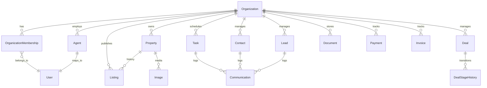

# CRM ორგანიზაციული მოდელის წინასუპაბეისური გეგმა (Stage 1)

## 1. Executive Summary
- მიზანია CRM-ის მრავალტენანტური არქიტექტურის სრული დაგეგმვა Supabase ინტეგრაციამდე.
- ძირითადი ერთეულები: `Organization`, `OrganizationMembership`, როლები (`owner/admin/manager/agent/support/client`), მომავალი CRM ცხრილები (`Lead`, `Contact`, `Deal`, `Task`, `Communication`, `Document`, `Payment`, `Invoice`, `DealStageHistory`, `IdempotencyKey`).
- არსებული მოდელებიდან Ownership-ის გაფართოება `organization_id`-ით და სწორი FK/ინდექსების პოლიტიკა.
- დოკში ხმარდება: სქემის ცვლილებები, როლების მატრიცა, lifecycle წესები, Prisma draft, backfill/constraint სტრატეგია, Mermaid ERD, ღია კითხვები და მომდევნო ნაბიჯები.

## 2. Entities & Attributes (draft)
### 2.1 Organization
| ველი | ტიპი | აღწერა | შენიშვნები |
|------|------|--------|------------|
| `id` | UUID | უნიკალური იდენტიფიკატორი | `@id @default(gen_random_uuid())` |
| `name` | String(150) | ორგანიზაციის სახელი | უნიკალური tenant-ში |
| `slug` | String(80) | URL-friendly | lowercase, გამოიყენება RLS-ში |
| `status` | Enum(`active`, `suspended`, `archived`) | საქმიანობის სტატუსი | `active` default |
| `defaultCurrency` | CurrencyType | ძირითადი ვალუტა | optional |
| `timezone` | String(40) | სერვისების დროის ზონა | Olson ფორმატი |
| `createdAt` / `updatedAt` | Timestamptz | audit | `@default(now())`, `@updatedAt` |
| `createdBy` | UUID | დამფუძნებლის user-id | FK `users.id` |

### 2.2 OrganizationMembership
| ველი | ტიპი | აღწერა | შენიშვნები |
|------|------|--------|------------|
| `id` | UUID | primary | |
| `organizationId` | UUID | კომპანია | FK `organizations.id` |
| `userId` | UUID | მემბერი | FK `users.id` |
| `role` | Enum(`owner`, `admin`, `manager`, `agent`, `support`, `client`) | RBAC |
| `status` | Enum(`pending`, `active`, `suspended`, `left`) | მოწვევის სტატუსი |
| `invitedBy` | UUID? | ვინ მოიწვია | FK `users.id` |
| `invitedAt` / `acceptedAt` / `revokedAt` | Timestamptz | timeline | nullable |
| `permissions` | Json? | granular override | optional |

- Composite unique: `@@unique([organizationId, userId])`
- Index: `@@index([userId, status])`

### 2.3 Supplementary Tables (optionally later)
- `OrganizationSetting` (billing, feature flags)
- `OrganizationDomain` (custom domains)
- `OrganizationInvitation` (თუ მოწვევები membership-ისგან განცალკევებით გვინდა)

## 3. Existing Model Touchpoints (`organization_id` გეგმები)
| მოდელი | მოქმედება | კომენტარი |
|--------|-----------|-----------|
| `User` | დაამატე `primaryOrganizationId` (nullable) | default tenant UI-ში |
| `Agent` | FK `organization_id` (NOT NULL) | აგენტი ერთი ორგანიზაცია |
| `Property` | `organization_id` (NOT NULL) | მფლობელობა |
| `Listing` | `organization_id` | control |
| `Image` | `organization_id` | media-tenancy |
| `Favorite`, `Appointment`, `Inquiry`, `Notification` | `organization_id` (NOT NULL) | routing |
| `Transaction` | `organization_id` | ფინანსები |
| `MortgageCalculation`, `SearchHistory` | nullable `organization_id` | guest/legacy |
| `AuditLog` | `organization_id` | tenant activity |
| CRM (`Lead`, `Contact`, `Deal`, `Task`, `Communication`, `Document`, `Payment`, `Invoice`) | ყველას აქვს `organization_id` |

> ზოგ მოდელს ( напр. `PropertyAnalytics`) შეიძლება ჰქონდეს derived `organization_id` `property`-იდან.

## 4. Role & Ownership Matrix
| როლი | აღწერა | უფლებები |
|------|--------|----------|
| owner | დამფუძნებელი | სრული წვდომა, როლების მართვა |
| admin | ფუნქც. ადმინისტრატორი | გუნდის მართვა, სრული CRM |
| manager | გუნდის ლიდერი | pipeline ადმინისტრაცია |
| agent | აგენტი | properties/leads/tasks/comm |
| support | მხარდაჭერა | inquiries/documents |
| client | კლიენტი | საკუთარი Deal/Task/Document-ის ნახვა |

Ownership წესები:
- თითო ორგანიზაციაში ≥ 1 owner.
- manager/agent/support უნდა იყოს `active`.
- client წევრობა შესაძლებელია auto-invite Deal-ის მიხედვით.
- granular override `permissions` JSON-ში.

## 5. Relationships (Mermaid draft)


## 6. Lifecycle Rules & Flows
1. Organization creation → founder ხდება owner; `defaultCurrency`/`timezone` optional; audit log.
2. Membership invite → `pending` → accept(`active`) / suspend / leave.
3. Ownership transfer → audit + reassignment.
4. Deletion/Archival → `soft_delete` (`deleted_at`) ან `status=archived`.

## 7. Prisma Draft (pseudocode; non-binding)
```
model Organization {
  id              String   @id @default(dbgenerated("gen_random_uuid()")) @db.Uuid
  name            String   @db.VarChar(150)
  slug            String   @unique @db.VarChar(80)
  status          OrganizationStatus @default(active)
  defaultCurrency CurrencyType? @map("default_currency")
  timezone        String? @db.VarChar(40)
  createdAt       DateTime @default(now()) @db.Timestamptz(6)
  updatedAt       DateTime @updatedAt @db.Timestamptz(6)
  createdBy       String? @map("created_by") @db.Uuid

  members    OrganizationMembership[]
  properties Property[]
  agents     Agent[]
  leads      Lead[]
  contacts   Contact[]
  deals      Deal[]

  @@map("organizations")
}

model OrganizationMembership {
  id             String   @id @default(dbgenerated("gen_random_uuid()")) @db.Uuid
  organizationId String   @map("organization_id") @db.Uuid
  userId         String   @map("user_id") @db.Uuid
  role           OrgRole  @default(agent)
  status         MembershipStatus @default(pending)
  permissions    Json?    @default("{}")
  invitedBy      String?  @map("invited_by") @db.Uuid
  invitedAt      DateTime? @map("invited_at") @db.Timestamptz(6)
  acceptedAt     DateTime? @map("accepted_at") @db.Timestamptz(6)
  revokedAt      DateTime? @map("revoked_at") @db.Timestamptz(6)

  organization Organization @relation(fields: [organizationId], references: [id], onDelete: Cascade)
  user         User         @relation(fields: [userId], references: [id], onDelete: Cascade)

  @@unique([organizationId, userId], name: "uq_org_member")
  @@index([userId, status], name: "idx_member_user_status")
  @@map("organization_members")
}

enum OrganizationStatus { active suspended archived }
enum OrgRole { owner admin manager agent support client }
enum MembershipStatus { pending active suspended left }
```

## 8. Backfill & Constraint Strategy (notes)
- Default org ერთჯერადად legacy მონაცემებისთვის.
- Nullable column → backfill → set NOT NULL → FK/Index.
- API ფენაში `organization_id` ფილტრი RLS-მდე.

## 9. Open Questions / Blockers
- JWT `org_id` claim-ის წყარო (Supabase `auth.users.app_metadata`?).
- Multi-org მომხმარებლები — active ორგანიზაციის არჩევა.
- Billing (`OrganizationSubscription`?), GDPR Export/Delete პროცედურები.
- Shared resources საჭიროება (public listings?).
- Invite token ვადები.
- Prisma script-ებიდან function-ების გაშვების fallback.

## 10. Next Steps
1. დოკის რევიუ და დამტკიცება.
2. Backfill & Migration სტრატეგიის გაღრმავება (Stage 2).
3. Trigger/Constraint სპეციფიკაციები (Stage 3).
4. API/Services დიზაინი (Stage 4).
5. ტესტებისა და DevOps გეგმები (Stage 5–6).


